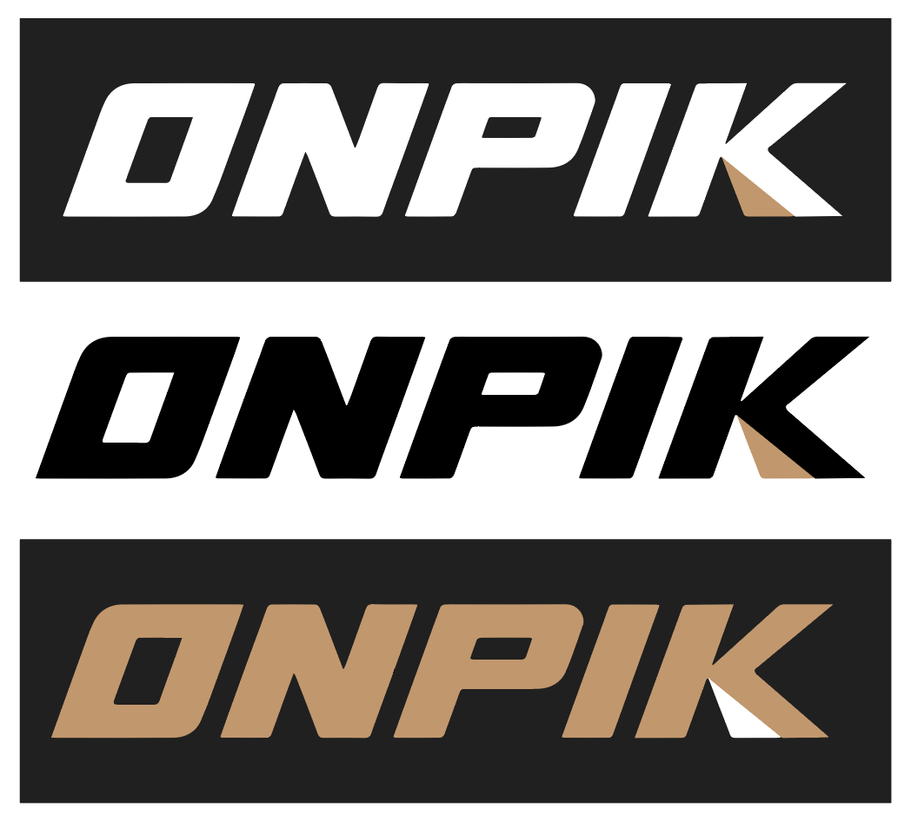
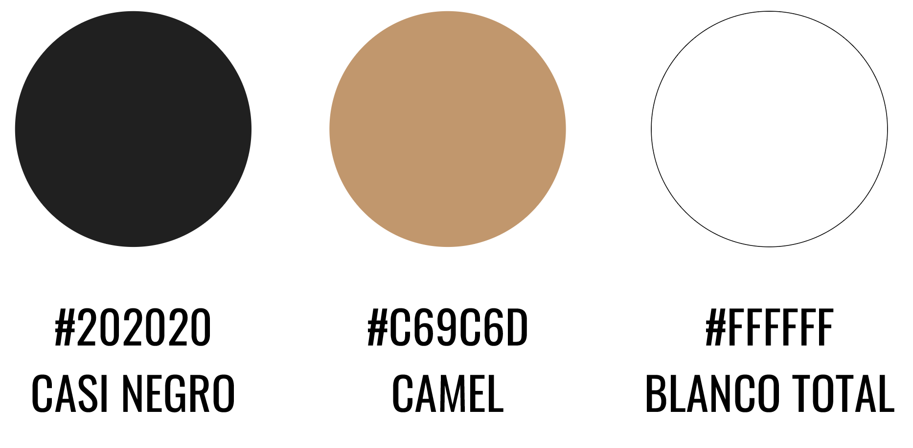
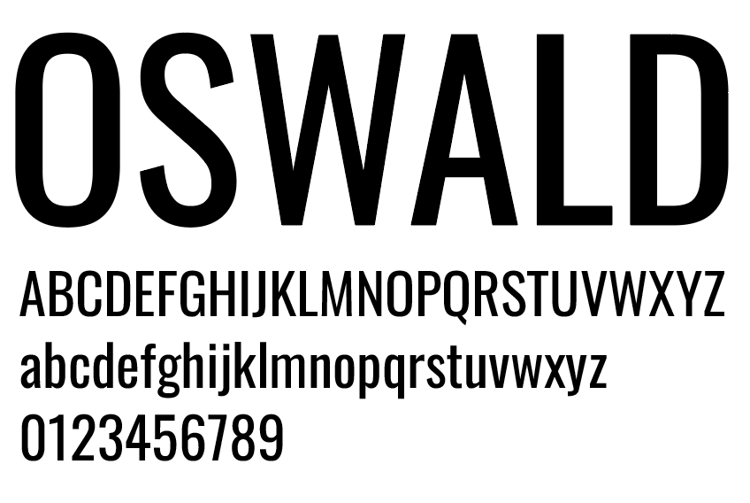
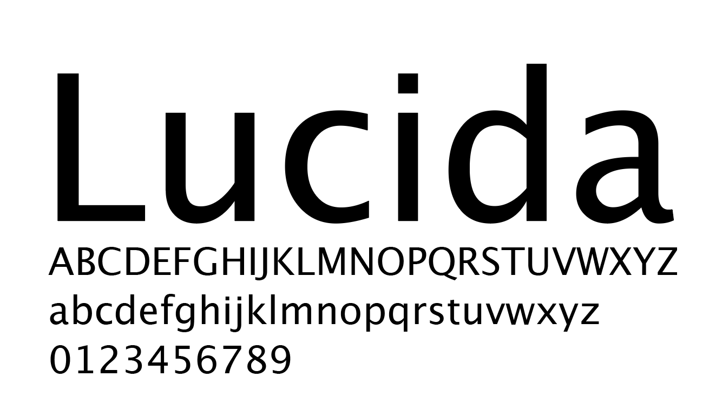

# Proyectos-JaimeNebot
LINK PORTFOLIO COMPLETO DE DESARROLLO WEB: https://web-jaime-nebot-git-main-jaimes-projects-7e668735.vercel.app 

## Proyectos del Máster:
Aquí podréis encontrar los enlaces a mis proyectos de Diseño Web y de Desarrollo Frontend:

PROYECTO PORTFOLIO: creación y diseño de portfolio creativo:
- Tecnologías utilizadas: HTML, CSS Y JAVASCRIPT.
- LINK: https://jaimeneco.github.io/Proyecto-final-JaimeNebot/ 

PROYECTO ONPIK: web de alquiler de material deportivo estacional (deportes de verano e invierno):
- Tecnologías utilizadas: ReactJS, CSS, JAVASCRIPT, EXPRESSJS y MONGODB.
- LINK FRONT: https://frontend-proyecto-fs-jaime-nebot.vercel.app/
- LINK BACK: https://backend-proyecto-fs-jaime-nebot.vercel.app/
 
### Logotipo y variantes:

### Selección de colores:

### Tipografías:

